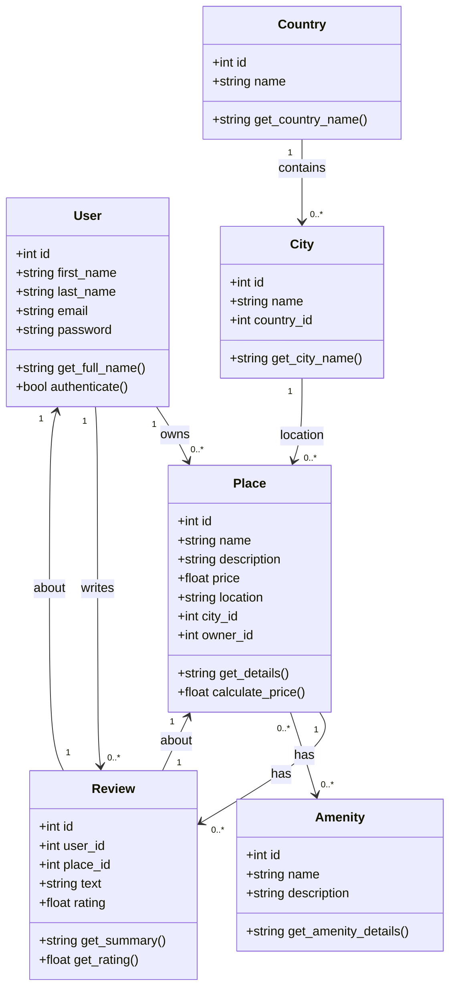

```mermaid
classDiagram
class User {
+int id
+string first_name
+string last_name
+string email
+string password
+string get_full_name()
+bool authenticate()
}

    class Place {
        +int id
        +string name
        +string description
        +float price
        +string location
        +int city_id
        +int owner_id
        +string get_details()
        +float calculate_price()
    }

    class Review {
        +int id
        +int user_id
        +int place_id
        +string text
        +float rating
        +string get_summary()
        +float get_rating()
    }

    class Amenity {
        +int id
        +string name
        +string description
        +string get_amenity_details()
    }

    class Country {
        +int id
        +string name
        +string get_country_name()
    }

    class City {
        +int id
        +string name
        +int country_id
        +string get_city_name()
    }

    User "1" --> "0..*" Place : owns
    Place "1" --> "0..*" Review : has
    User "1" --> "0..*" Review : writes
    Review "1" --> "1" User : about
    Review "1" --> "1" Place : about
    Place "0..*" --> "0..*" Amenity : has
    City "1" --> "0..*" Place : location
    Country "1" --> "0..*" City : contains
```
